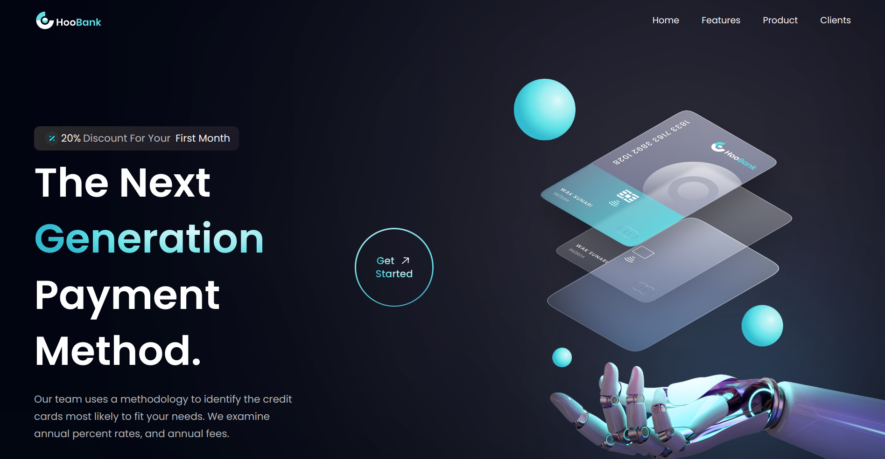

 # 
 Mock Business Site 

 ### 
 A static React webpage made using Tailwind css. 

 ### 
 [Live Demo](https://christofb7.github.io/bank-modern-app/) 

>### 
 About: 

Hoobank is a mock business site.

### It includes:
 - Data, images, and styles are built in a way for non-technial users to adjust information.
 - Tailwind css to quickly style and format.
 - Components like a call to action button, or card items that get reused throughout the webpage.
 - Using github pages and gh-pages dependency to host and deploy the react application to the github cloud.
 - Using media queries to create a responsive design.

 >### 
 Built with: 

 

  

 - React
 - Tailwind
 - Node js
 - Figma

 ### Key Concepts:
- React Basics
    - JSX
    - Props
    - State
    - Events
    - Conditional Rendering
- Tailwind
- Figma Basics
    - Basics of UX Design
    - Animating content
    - Typography in design
    - Responsive Web Design

